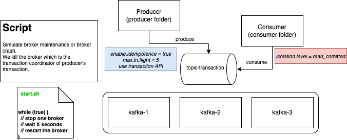

# What happens when a cluster roll during a transaction pending ?



Aim of this benchmark : If a cluster roll happens during a transaction, and if the broker down is the transaction coordinator of this transaction, what happens ? 

After a lot of tests, often the librdkafka-based client doesn't complete the AbortTransaction operation. Client will be dispose 10 minutes after trying to abort the transaction. 

# How to test ?

You have just to start the script `start.sh`. This scripts package a admin-cli-tools, start the kafka stack, start producer & consumer and simulate broker crash, specially the broker which is the transaction coordinator of the transaction's producer.

## Require tools

- maven
- jq
- docker & docker-compose

## Start 

``` bash
./start.sh
```

When the producer is started, you can check the logs. At some points, the producer will be blocked, and will be unblocked 10 minutes later when the abort transaction operation will be not acked.

Open a new terminal :
``` bash
docker-compose logs -f producer
```

You can inspect an example log of the problem [here](./issue.log).

## Stop

``` bash
./stop.sh
```

# How to fix ? 

Please `confluent-kafka-dotnet` >= 1.9.0 to fix this [issue](https://github.com/edenhill/librdkafka/issues/3779).